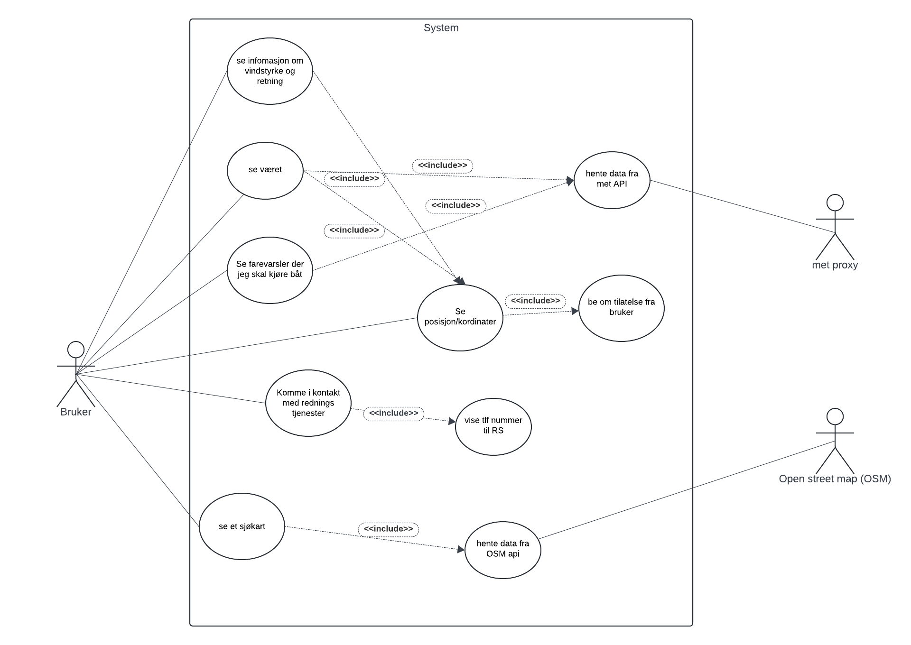
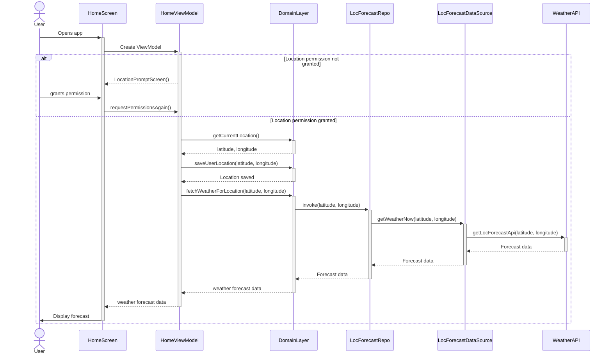
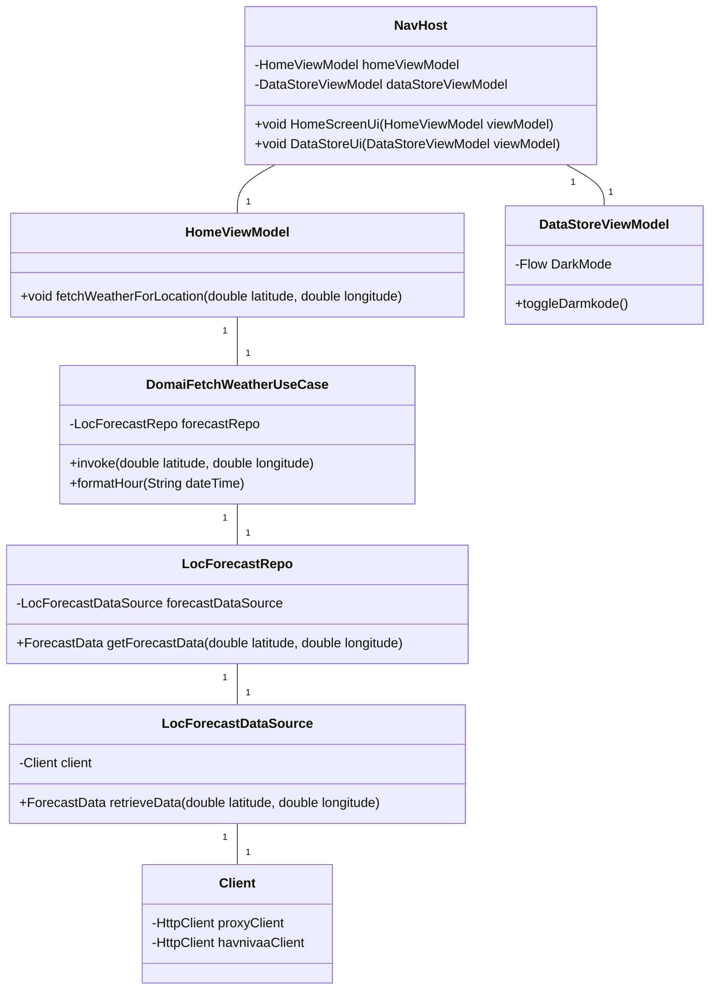

Usecase diagram for de forskjellige usecasene:

Modelering av usecaset se været frem i tid.

``` mermaid
sequenceDiagram
    actor U as User
    participant HS as HomeScreen
    participant HSVM as HomeViewModel
    participant D as DomainLayer
    participant R as LocForecastRepo
    participant DS as LocForecastDataSource
    participant API as WeatherAPI

    U->>+HS: Opens app
    HS->>+HSVM: Create ViewModel
    alt Location permission not granted
        HSVM -->> HS: LocationPromptScreen()
         U ->> HS: grants permission
        HS->>HSVM: requestPermissionsAgain()
       

    else Location permission granted
        HSVM->>+D: getCurrentLocation()
        D-->>-HSVM: latitude, longitude
        HSVM->>+D: saveUserLocation(latitude, longitude)
        D-->>-HSVM: Location saved
        HSVM->>+D: fetchWeatherForLocation(latitude, longitude)
        D->>+R: invoke(latitude, longitude)
        R->>+DS: getWeatherNow(latitude, longitude)
        DS->>+API: getLocForecastApi(latitude, longitude)
        API-->>-DS: Forecast data
        DS-->>-R: Forecast data
        R-->>-D: Forecast data
        D-->>-HSVM: weather forecast data
        HSVM-->>-HS: weather forecast data
        HS->>-U: Display forecast
    end
```
En forenklet modell av appen

```mermaid
classDiagram
    class NavHost {
        -HomeViewModel homeViewModel
        -DataStoreViewModel dataStoreViewModel
        +void HomeScreenUi(HomeViewModel viewModel)
        +void DataStoreUi(DataStoreViewModel viewModel)
    }

    class HomeViewModel {
        +void fetchWeatherForLocation(double latitude, double longitude)
    }

    class DataStoreViewModel {
        -Flow DarkMode
        +toggleDarmkode()
    
    }

    class DomaiFetchWeatherUseCase{
        -LocForecastRepo forecastRepo
        +invoke(double latitude, double longitude)
        +formatHour(String dateTime)
    }

    class LocForecastRepo {
        -LocForecastDataSource forecastDataSource
        +ForecastData getForecastData(double latitude, double longitude)
    }

    class LocForecastDataSource {
        -Client client
        +ForecastData retrieveData(double latitude, double longitude)
    }

    class Client {
        -HttpClient proxyClient
        -HttpClient havnivaaClient
    }


    NavHost "1" -- "1" HomeViewModel
    NavHost "1" -- "1" DataStoreViewModel
    HomeViewModel "1"--"1" DomaiFetchWeatherUseCase
    DomaiFetchWeatherUseCase "1"-- "1"LocForecastRepo
    LocForecastRepo "1" -- "1"LocForecastDataSource
    LocForecastDataSource "1"-- "1"Client
    
    


```